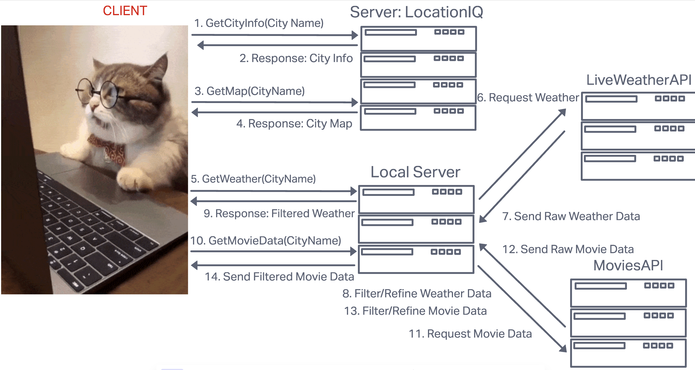

# City Explorer

**Author**: Benjamin Small
**Version**: 1.0.0 (increment the patch/fix version number if you make more commits past your first submission)

## Overview

This application allows the user to search for cities around the world and get information and map data on the requested city.

## Getting Started
<!-- What are the steps that a user must take in order to build this app on their own machine and get it running? -->

## Architecture
<!-- Provide a detailed description of the application design. What technologies (languages, libraries, etc) you're using, and any other relevant design information. -->

### WRRC

## Change Log
<!-- Use this area to document the iterative changes made to your application as each feature is successfully implemented. Use time stamps. Here's an example:

01-01-2001 4:59pm - Application now has a fully-functional express server, with a GET route for the location resource. -->

## Credit and Collaborations

Sam Brindle helped me get the map to display.

### Time Estimates

1. Feature Task #1
   - Name: Set up your React repository & API keys.
   - Estimated Time: 40 min
   - Start: May 16, 2022 2:55pm
   - End: May 16, 2022 3:40
   - Actual Time: 45 min

2. Feature Task #2
   - Name: Capture City Data based on API call.
   - Estimated Time: 45 min
   - Start: May 16, 2022 3:45pm
   - End: May 16, 2022 5:00pm
   - Actual Time: 1 hr 15 min

3. Feature Task #3
   - Name: Display Map or city based on captured latitude and longitude.
   - Estimated Time: 1 hr
   - Start: May 16, 2022 5:15pm
   - End: May 16, 2022 6:15pm
   - Actual Time: 1 hr

4. Feature Task #4
   - Name: Error Handling.
   - Estimated Time: 30 min
   - Start: May 16, 2022 6:15pm
   - End: May 16, 2022 6:45pm
   - Actual Time: 30 min
   - Comments: I actually worked on this one progressively the whole time, but then focused on it at the end.
